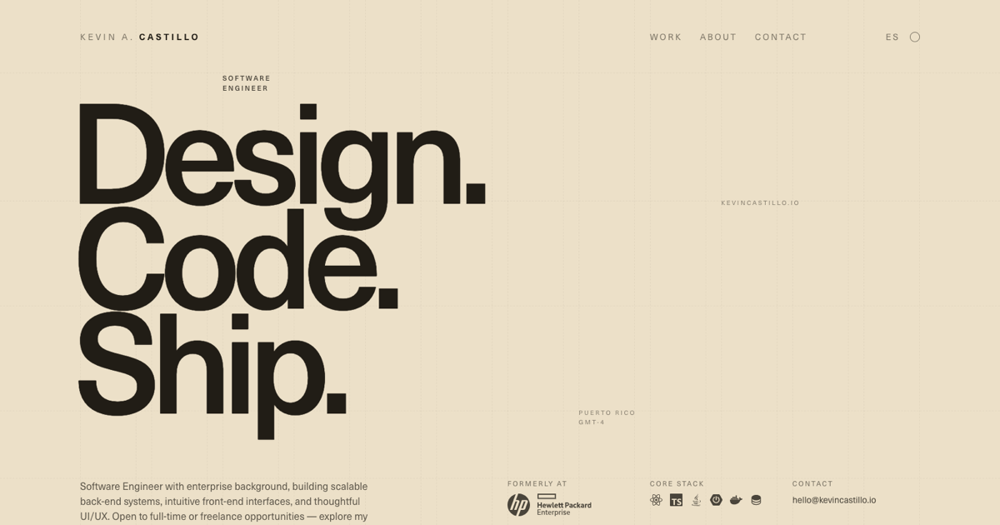

# kevincastillo.io

Kevin Castillo's portfolio — a poster/Swiss-typography-driven redesign built
with Astro 5, Tailwind 4 (CSS-config) and MDX, bilingual (English/Spanish).

## Features

- Bilingual (English/Spanish), with light and dark themes.
- 12-column grid design system with plotted grid-line accents, driven entirely
  by design tokens in `src/styles/global.css`.
- No component libraries — plain Astro components and vanilla JavaScript.
- View Transitions API for SPA-like navigation between the home page and
  project case studies.
- Astro Content Collections + MDX for project case studies, with reusable
  `TextBlock`, `Image`, `ImageBezel`, `ImageGrid` and `Video` components.
- WebP images and compressed MP4 video, Neue Haas Unica (Adobe Typekit).

## Stack

Astro 5 · Tailwind CSS 4 · MDX · TypeScript · deployed on Cloudflare Pages.

## Commands

This project uses **bun** as its package manager — always use `bun install` /
`bun add`, not `npm install`, to keep `bun.lockb` in sync (Cloudflare's build
runs `bun install --frozen-lockfile` and hard-fails on drift). `npm run
<name>` is fine for running scripts, since it just reads `package.json`.

| Command              | Action                                               |
| :------------------- | :---------------------------------------------------- |
| `bun install`        | Install dependencies                                   |
| `bun add <pkg>`      | Add a dependency (keeps `bun.lockb` in sync)            |
| `npm run dev`        | Start the local dev server at `localhost:4321`          |
| `npm run build`      | Type-check (`astro check`) and build to `./dist/`       |
| `npm run preview`    | Preview the production build locally                    |
| `npm run astro ...`  | Run Astro CLI commands (`astro add`, `astro check`)      |

## Want to see it in action?

Visit the [deployed site](https://kevincastillo.io).

## License and Attribution

This project is licensed under the [MIT License](LICENSE).
Feel free to fork or use this code in your project, but **please include appropriate credit** by linking back to this repository or mentioning the original author, Kevin Castillo.
Attribution helps support and recognize open-source contributions.
